# **SORRY Dog:** Meme Apology Token - Whitepaper
## *A Hybrid ERC20-ERC721 "Levels Token Standard" for Digital Apologies & Community-Driven Meme Utility*

| Version | Date | Description |
|---------|------|-------------|
| `0.1.0-250401` | 2025-04-01 | Initial draft |
| `0.1.1-250410` | 2025-04-10 | Update lore and technical design |
| `0.1.2-250414` | 2025-04-14 | References & links |

<br/>

|**Author**|[Clyde C. "Sadfaced Dev"](https://sadfaced.eth.limo)|
|-:|--|
|**Reviewers**| 1. [M. R. Shimamoto (Shima)](https://twitter.com/mrshimamoto) <br> 2. [...](https://twitter.com/#)|


---

||Official Links|
|-:|--|
|||
|**Website**|[https://sorry.dog][SORRY Website]|
|**GitHub**|[https://github.com/sorry-dog][SORRY GitHub]|
|**ENS**|[sorrydog.eth][SORRY ENS]<br>[sorry.base.eth][SORRY ENS Base]<br>[区块链舔狗.eth][SORRY ENS Chinese]|
|**TON Space**|[sorrydog.ton](https://sorrydog.ton.run)|
|**Twitter**|[https://twitter.com/sorrydog_meme][SORRY Twitter]|
|**Telegram**|[https://t.me/sorrydog_meme][SORRY Telegram]|

---

## Abstract

At its core, the SORRY Protocol is both a technological innovation and a love story - a testament to a developer's regret and his quest for redemption, encoded in blockchain. 

This paper introduces the SORRY token, and the "Levels Token Standard". This novel hybrid token standard combines the fungibility of ERC20 tokens with the uniqueness of ERC721 non-fungible tokens (NFTs). We present a multi-level NFT system tied to token balances, where users automatically receive NFTs of increasing rarity as their token holdings reach predefined thresholds. The paper details the mathematical framework, architectural design, and economic mechanisms of the SORRY protocol, including cross-chain compatibility, token-based social mechanisms, and a unique apology-themed ecosystem. We demonstrate that our dual-contract approach maintains full [ERC20][ERC20] and [ERC721][ERC721] compliance while offering enhanced functionality compared to existing hybrid token implementations like [ERC404][ERC404], [DN404][DN404], and [ERC7631][ERC7631].

The protocol launches on both Ethereum and Base networks, featuring cross-chain compatibility. Token supply is controlled by the token contract on Ethereum, but protocol features and Level Token utility primarily exist on Base Chain. Once bridged to Base, the fully featured SORRY token is unlocked.

At its core, SORRY Dog is not just another meme token—it's a platform for digital apologies, community-driven narratives, and a love story encoded in blockchain technology. Through its multi-level NFT system, dedicated troves for token locks, and unique simp/no-simp governance mechanism, SORRY creates a social experience that blends entertainment with genuine utility.

Through code and lore, dev Clyde hopes that SORRY Dog Token Protocol will capture the hearts of the community, and in doing so, re-capture the heart of his dear lost love, Chloe. The SORRY Protocol creates an apology-regret-remorse-and-redemption economy, adding utility to the meme. With geo-based leaderboards, novel token features, a 100% community distribution, and a comprehensive economic model that emphasizes fairness and long-term sustainability. 

---

<!-- ## Table of Contents
1. [Introduction](#1-introduction)
2. [The SORRY Lore](#2-the-sorry-lore)
3. [Core Technical Design](#3-core-technical-design)
4. [Protocol Features](#4-protocol-features)
- 4.1. [SORRY Troves](#41-sorry-troves)
- 4.2. [Apology Logger & Leaderboards](#42-apology-logger--leaderboards)
- 4.3. [Liquidity Vending Machines](#43-liquidity-vending-machines)
- 4.4. [SORRY Governance](#44-sorry-governance)
- 4.5. [Simp/NoSimp Voting Game](#45-simpnosimp-voting-game)
- 4.6. [Additional Features](#46-additional-features)
5. [Tokenomics & Liquidity](#5-tokenomics--liquidity)
6. [Development Roadmap](#6-development-roadmap)
7. [Background & Related Work](#7-background--related-work)
8. [Future Applications & Next Steps](#8-future-applications--next-steps)
9. [Conclusion](#9-conclusion)
10. [Appendix](#10-appendix)
--- -->

## 1. Introduction

The SORRY Protocol introduces a novel hybrid token standard that combines [ERC20 fungibility][ERC20] with [ERC721 collectability][ERC721] in a multi-tiered system. Unlike previous attempts at hybrid tokens, SORRY's "Levels Token Standard" creates a seamless ecosystem where users can transact with fungible tokens while automatically earning multiple levels of NFT status badges based on their holdings.

At its core, the SORRY Protocol is both a technological innovation and a love story - a testament to a developer's regret and his quest for redemption, encoded in blockchain. It serves as a platform for digital apologies, community storytelling, and a shared economic experiment in the value of saying *"I'm sorry."*

---

## 2. The SORRY Lore

In the ever-evolving world of crypto, some projects are born of innovation, others of speculation, but SORRY was born of love, regret, and a promise.

In the words of the developer, Clyde:

> *"This is the techno-modern version of the JukeBox from Say Anything. This is a shy dev's equivalent of making a fool of himself in front of a crowd to get the girl. This is '**Simp-maxing-1000x**'."*
>
> — ***Dev Clyde*** 


### 2.1 The Heartbreak Behind the Meme

#### **2.1.1 The Dawn:** *Dog Tokens & a Pinky Promise*

Back in 2020, when SHIB was just beginning its meteoric rise, a young woman named Chloe stood in her kitchen talking to her bestfriend Clyde — a blockchain enthusiast and developer. Laughing at the absurdity of the situation with SHIB, Chloe suggested the two team up to create a meme token called "SORRY". She thought it would be funny and meaningful ticker for a meme token at the same time. 

Always the cunning business woman, Chloe quickly added a condition:
> "*If you ever make that token, you have to promise me you will give me 1,000,000 SORRY.*
>
> "*You have to pinky primise me.*
>
> "*Do you promise?*"

Clyde laughed, presenting his outstreched pinky. 

With that single action, their fates were sealed. Yet it wasn't long before tragedy struck the Twin Flames.

#### **2.1.2 The Estrangement:** *Push & Pull of Twin Flames*

As so often happens when men and women try to be friends, Chloe and Clyde's relationship went from a beautiful friendship to a tumultuous romance to a painful estrangement.

For the next four years, their relationship existed in a perpetual "will-they-won't-they" state. Chloe remained loyal, watching from the sidelines as Clyde continued to spurn her advances, rejecting his one chance at true love for the fleeting attention of trashy women and 304s.


Finally, in a moment of [*who the fuck knows what she was thinking*], Chloe made one last attempt to win Clyde's heart.

She pitched him on their shared future once more, painting a picture of their wedding, their family, and their future growing old together.

#### **2.1.3 The Flippening:** *The Runner Becomes the Chaser*

Surprisingly, this time, Clyde agreed - but the timing had shifted.

Fate has a cruel sense of humor. Whether as karma for years of neglect, because her family would never approve of her marrying a blockchain developer, or because she had truly moved on, Chloe rejected him, turning the tables on the man who had kept her waiting for so long. Dev Clyde was broken hearted.


#### **2.1.4 The Breakdown:** *Losing Touch with Reality*

For months, Clyde was in a funk. He spent his days gambling, YOLOing his life savings into every CASHTAG crypto-twitter said was hot. Somehow the 100x gains kept hitting. It was the universe's cruel joke. The richer he got, the more he wanted to throw it all away. Dispite his ever increasing wealth, he would spend his nights crying himself to sleep. He was a shell of the man he once was.

Then, one day, he got an idea: "I should eat a bunch of food and get fat. That will show her!"

He was clearly losing his mind.

In a delirious trance, Clyde started scrambling to eat. Muching on anything he could find. Chowing down on whatever was in sight. Frantically grabbing for anything within his reach and stuffing it into his mouth. Hoovering up as much as he could, trying to get fat as quickly as possible.

Fortunately for the still-svelte Clyde, the first thing he grabbed was a first full of magic mushrooms.

He got high.

He got horny.

He got sad.

He got sorry.

He got a new idea.

While lying in bed talking to the spaceman on his ceiling, he shared his story of love, regret, and his pinky promise from all those years ago.

The astronaut cat listened intently, before coughing up a ball of yarn. Dev Clyde instantly knew what it meant.

#### **2.1.5 The Revelation:** *Dev should be deving*

Devastated by the love reversal, Clyde turned to what he knew best - coding. What began as personal therapy and an artistic tribute to Chloe evolved into the SORRY Protocol: a digital monument to his mistake and a desperate hope that if the project gained enough popularity, Chloe might see it and understand it was created for her.

It's a long shot. It's the only shot.

#### **2.1.6 The Promise Kept:** *SORRY Token & Chloe's Trove*

Today, Clyde is making good on his promise from all those years ago.

The SORRY token launches with 1,000,000 SORRY tokens waiting in a special trove for Chloe. The trove is protected by 5 secret questions -- shared secrets from the lovers' pasts.

#### **2.1.7 The Hesitation:** *Maybe this is all a Mistake*

It has been one year since the trip that inspired Clyde to finanlly create SORRY. In that time he's done a lot of healing. Creating SORRY was a fun project. It started as a way to express his love for Chloe but it turned into a way to deal with his grief. Now, on the eve of the SORRY token launch, Clyde is unsure if he actually wants to win Chloe back.

He still wants her with his heart, but in his mind he wonders if it is a good idea.

Dev is broken hearted. He needs the community help.

> *"When I come up with the idea of launching SORRY, one year ago, all I want is win her back. I spend the last year wondering... am I making the biggest mistake of my life? Am I just a pathetic simp? Am I just a sadfaced dog? Am I 区块链舔狗? I don't know. I do know what to do. So I am leaving that up to the community. Do I continue to **SIMP** or **NO SIMP**? I do not know what to do. I need you to help me."*
>
> — ***Dev Clyde***

#### **2.1.8 The Solution:** *Simp or No Simp — The Community Decides*

Now the community will decide: should dev try to win the girl or should dev forget Chloe? Participate in weekly "Simp or NoSimp" vote to encourage Clyde to keep his hopes up, or to give up and move on — get over her dude! Each time the community votes **SIMP**, 1M SORRY get added to Chloe's Trove. Hopefully, with the increasing value of Chloe's Trove, the news will talk and one day capture the attention of Chloe. Or the community votes **NO SIMP**, 1M SORRY get burned. Community is telling Clyde to get over her and move on.


### 2.2 Beyond the Story of Chloe + Clyde: A Platform for Digital Apologies

SORRY isn't just Clyde's digital apology letter — it is a platform for everyone to share their own stories of love, regret, remorse, and reconciliation. It's a techno-art project. A meme token with utility and novel mechanics, allowing users to:

- Collect SORRY and level up with multiple NFT collections for different tiers of simp/sorry energy
- Create on-chain apology messages as NFT Troves, with SORRY reparations, protected by secret questions.
- Compete on apology leaderboards 
- Build cryptographic puzzles using shared knowledge to prove sincerity
- Express themselves through various levels of commitment

In Clyde's words: *"This is the techno-modern version of the JukeBox from Say Anything. This is a shy dev's equivalent of making a fool of himself in front of a crowd to get the girl. This is Simp-maxing-1000x."*

Is it a meme? Yes. Is it a token? Yes. Is it a collectible? Yes. Is it utility? Yes. Is it a protocol? Yes. Is it a community? Yes. Is it a social movement? Yes. Is it a story? Yes. Is it SORRY? Yes.

Is it romantic? Maybe. Is it pathetic? Probably. Is it a love story? Kinda. Is it a tragedy? TBD.

It's a story about a guy who fucked up and just wants to say he is sorry. The rest is for you to decide...

### 2.3 Numerology and the Significance of "555"

The number "555" holds special cultural significance in the SORRY protocol:

- In Chinese online slang, "555" represents the sound of crying or sobbing, similar to "呜呜呜" (wū wū wū) in Mandarin.
- The first valuable NFT threshold begins at 555 SORRY tokens
- Token addresses for major system components are deployed to addresses that start and end with 0x555...555
- Every 555th trove created receives a 555 SORRY rebate
- Magic numbers tied to rare level traits

This numerological theming encodes the cultural foundations of apology, grief, and vulnerability directly into the protocol's structure.

Other special numbers are used throughout the protocol. Some hold cultural significance, some are just funny numbers (dev has same sense of humor as Elon Musk). Try to find them all!

---

## 3. Core Technical Design

> [!CAUTION]
> **None of the contracts have been audited. Use at your own risk.**

### 3.1 The Levels Token Standard

SORRY introduces a novel token standard that we call the "Levels Token" - a hybrid that combines the fungibility of ERC20 with the unique collectible aspects of ERC721 in a tiered system.

### 3.2 ERC20-ERC721 Compatibility

The SORRY token functions as a standard ERC20 token with 18 decimals for technical compatibility. However, it implements an internal restriction that effectively truncates precision to 6 decimals for user interactions. This design decision enables:

**Key innovation points:**

1. **Full Standards Compatibility**: Unlike earlier hybrid tokens that compromised compatibility, SORRY maintains full compliance with both ERC20 and ERC721 standards through a multi-contract architecture.

2. **Automatic Level Thresholds**: Users automatically receive NFTs when their token balance crosses predefined thresholds, with higher balances unlocking higher-level NFTs.

3. **Dual Interface Functions**: The protocol provides hybrid functions that can interpret parameters appropriately for both ERC20 and ERC721 operations:

```solidity
function transfer(address to, uint256 amountOrTokenId) returns (bool);
function transferFrom(address from, address to, uint256 amountOrTokenId) returns (bool);
```

Where `amountOrTokenId` is treated as an ERC20 amount if it's greater than 10^6 (a full token), otherwise it's treated as an ERC721 tokenId.
- Values greater than 10^6 are treated as ERC20 amounts
- Values less than 10^6 are treated as ERC721 tokenIds

The protocol introduces an `effectiveDecimals()` function to return the number of decimals (6) actually used for the ERC20 portion of the token, while the standard `decimals()` function returns 18 for compatibility.

### 3.3 SORRY Dog Levels System

The SORRY token implements four distinct NFT levels based on token balance:

| Level | Required Balance | Name             |
|-------|------------------|------------------|
| 0     | ≥ 1 SORRY        | "Dog"            |
| 1     | ≥ 555 SORRY      | "Sad Dog"        |
| 2     | ≥ 6,969 SORRY    | "Apology Dog"    |
| 3     | ≥ 42,069 SORRY   | "Sorry Dog"      |

As users accumulate SORRY tokens, as they cross the balance thresholds, they automatically are minted NFT representations of their levels:


   $$L(b) = \begin{cases}
   0 & \text{if } 1 \leq b < 555 \\
   1 & \text{if } 555 \leq b < 6,969 \\
   2 & \text{if } 6,969 \leq b < 42,069 \\
   3 & \text{if } b \geq 42,069
   \end{cases}$$

**Key features of the Levels system:**

- **Dynamic NFT Minting/Burning**: When a user's balance crosses a threshold (either up or down), the corresponding NFT is automatically minted or burned.
- **Unique TokenID Ranges**: Each level is assigned a specific range of tokenIDs, making it easy to identify an NFT's level.

- **TokenID Recycling**: The protocol maintains a stack (LIFO) of burned tokenIDs, reusing them for new mints to save gas and keep the collection size bounded. We will keep a stack (LIFO) of burned token IDs. When a new token is minted, we will check the stack to see if there are any burned IDs available. If there are, we will use one of those. If there are no burned IDs, we will use the next available ID.

- **Gas Optimization**: To prevent excessive gas costs, the system limits NFT operations to 10 at a time.

```mermaid
graph TD
    classDef level0 fill:#f9d0c4,stroke:#333,stroke-width:1px
    classDef level1 fill:#ffc0cb,stroke:#333,stroke-width:1px
    classDef level2 fill:#c8a2c8,stroke:#333,stroke-width:1px
    classDef level3 fill:#9370db,stroke:#333,stroke-width:1px
    classDef threshold fill:#f5f5f5,stroke:#333,stroke-width:1px,stroke-dasharray: 5 5

    subgraph "Token Level System"
        direction LR
        L0["Level 0: 🐶"] --> L1["Level 1: 😢"] --> L2["Level 2: 🙏"] --> L3["Level 3: 🆘"]
        L0T["≥ 1 SORRY"] --> L1T["≥ 555 SORRY"] --> L2T["≥ 6,969 SORRY"] --> L3T["≥ 42,069 SORRY"]
    end
```



**Additional Diagrams:**

<details>
<summary>Levels System Flowchart</summary>

#### 3.3.1 Levels System Flowchart

```mermaid
graph TD
    classDef level0 fill:#f9d0c4,stroke:#333,stroke-width:1px
    classDef level1 fill:#ffc0cb,stroke:#333,stroke-width:1px
    classDef level2 fill:#c8a2c8,stroke:#333,stroke-width:1px
    classDef level3 fill:#9370db,stroke:#333,stroke-width:1px
    classDef threshold fill:#f5f5f5,stroke:#333,stroke-width:1px,stroke-dasharray: 5 5

    Start("🧑 User Balance") --> Balance[User SORRY Token Balance]
    
    Balance --> Threshold0{"≥ 1 SORRY?"}
    Threshold0 -->|No| NoLevel["No Level NFT"]
    Threshold0 -->|Yes| Level0["Level 0: 🐶 Dog\n- TokenID: 4xx,xxx,xxx,xxx\n- Basic Collection Access\n- Standard Traits"]
    
    Level0 --> Threshold1{"≥ 555 SORRY?"}
    Threshold1 -->|No| EndL0[Remain at Level 0]
    Threshold1 -->|Yes| Level1["Level 1: 😢 Sad Dog\n- TokenID: 3x,xxx,xxx\n- Trove Discounts\n- Uncommon Traits\n- Apology Boosts"]
    
    Level1 --> Threshold2{"≥ 6,969 SORRY?"}
    Threshold2 -->|No| EndL1[Remain at Level 1]
    Threshold2 -->|Yes| Level2["Level 2: 🙏 Apology Dog\n- TokenID: 2x,xxx,xxx\n- Governance Multiplier\n- Rare Traits\n- Enhanced Messaging"]
    
    Level2 --> Threshold3{"≥ 42,069 SORRY?"}
    Threshold3 -->|No| EndL2[Remain at Level 2]
    Threshold3 -->|Yes| Level3["Level 3: 🆘 Sorry Dog\n- TokenID: 1xx,xxx\n- Max Voting Power\n- Legendary Traits\n- Cross-chain Benefits\n- Special Access"]
    
    class Threshold0,Threshold1,Threshold2,Threshold3 threshold
    class Level0 level0
    class Level1 level1
    class Level2 level2
    class Level3 level3

```



</details>

<details>
<summary>Levels System Contract Architecture</summary>

#### 3.3.2 Levels System Contract Architecture


</details>


### 3.4 TokenID System and Ranges

Each NFT level has a dedicated TokenID range, making it easy to identify an NFT's level:

| Level | Leading Digit | Magnitude | TokenId Range                          |
|-------|---------------|-----------|----------------------------------------|
| 0     | 4             | 10^11     | `: 400,000,000,000 -> 402,100,000,000` |
| 1     | 3             | 10^9      | `:   3,000,000,000 ->   3,003,783,783` |
| 2     | 2             | 10^7      | `:      20,000,000 ->      20,030,133` |
| 3     | 1             | 10^5      | `:               1 ->         138,806` |


For gas efficiency and collection management, the protocol maintains a stack (LIFO) of burned token IDs, reusing them for new mints before creating new IDs.

The `tokenId` ranges where decided based on the theoretical maximum number of NFTs that could be minted at each level, assuming the tokenId is upto 12 digits.

**Theoretical Max Supply:** 2,100,000,000 SORRY

```
Theoretical Max Level Tokens:
1. Level 0: 2,100,000,000
2. Level 1:     3,783,783
3. Level 2:       301,334
4. Level 3:        49,917
```

`tokenId` ranges are reserved for each level. Higher levels get lower tokenId ranges. You can easily identify the level by the magnitude of the leading most significant digit, any by that digit's value.

#### Special Case: Level 3 "Sorry Dog" NFTs

Level 3 actually has the special range of $[1, 199,999]$. The leading digit is always a 1, so IDs will go:

```
   1,
   10, 11, 12, 13, 14, 15, 16, 17, 18, 19,
   100, 101, 102, 103, 104, 105, ..., 198, 199,
   1000, 1001, 1002, 1003, 1004, 1005, ..., 1998, 1999,
   10000, 10001, 10002, 10003, 10004, 10005, ..., 19998, 19999,
   100000, 100001, 100002, 100003, 100004, 100005, ..., 199998, 199999
```

This gives $1 + 10 + 100 + 1000 + 10000 + 100000 = 111,111$ possible token IDs for level 3 (in actuality, at most $49,917$ IDs will be needed).

#### **TokenID Range Algorithm**
   Define how tokenIDs are assigned within specific ranges:

   $$\text{TokenID}_{L_i} = \text{Base}_{L_i} + \text{Counter}_{L_i} \mod \text{Max}_{L_i}$$

   *Where:*
   - $\text{Base}_{L_i}$ is the starting ID for level $i$
   - $\text{Counter}_{L_i}$ is the current count of minted tokens at level $i$
   - $\text{Max}_{L_i}$ is the maximum number of tokens possible at level $i$


### 3.5 Token Architecture

SORRY implements a DN404-inspired multi-contract architecture:

```
SORRYDog (Proxy) → SORRYDogToken (Implementation)
    ├── ShadowSorryERC20Proxy → ShadowSorryERC20TokenV1 (IERC7631Base)
    ├── ShadowSorryERC721ProxyL0 → ShadowSorryERC721TokenL0 (IERC7631Mirror)
    ├── ShadowSorryERC721ProxyL1 → ShadowSorryERC721TokenL1 (IERC7631Mirror)
    ├── ShadowSorryERC721ProxyL2 → ShadowSorryERC721TokenL2 (IERC7631Mirror)
    └── ShadowSorryERC721ProxyL3 → ShadowSorryERC721TokenL3 (IERC7631Mirror)
```


This structure:
- Separates ERC20 functionality from the ERC721 collections
- Maintains synchronized state through a central coordinator
- Ensures full compliance with both token standards
- Implements upgradeability via UUPS proxy pattern

### 3.6 Cross-Chain Implementation

The SORRY Protocol operates across both Ethereum and Base networks:

- **Ethereum**: Houses the main ERC20 token contract and (eventually) Level 3 NFTs
- **Base**: Hosts the full Levels Token implementation, level NFT minting and burning, and all additional protocol features
- **Bridging**: Users can bridge SORRRY back to Ethereum, but they will lose their NFTs in the process. Eventually, we will support bridging Level 3 NFTs from Base to Ethereum (soon™). If NFTs are enabled on Ethereum, only burning will be supported. If a user's Ethereum balance falls below 42,069 SORRY, their Level 3 NFT is automatically burned and this information is passed back to Base through the L1 -> L2 bridge calling function.

This design leverages Ethereum's liquidity and security while using Base's lower fees for complex operations.

### 3.7 Dynamic NFT Traits

Each NFT (especially at Levels 1-3) includes on-chain generated random traits:

- **Randomization**: Uses a pseudorandom number generator, then upgrading to a commit-reveal scheme for fair trait generation, or VRF in the future.
- **Trait Categories**: Includes rarity levels and visual characteristics
- **On-chain Lore**: Higher-level NFTs include expanded backstories

Future 3-transaction randomization process:
1. Uses block hash as seed
2. Reveals traits after 3 subsequent mint transactions
3. Handles multiple mints in the same transaction with incremental seeds
4. Can be upgraded to Chainlink VRF or similar in future versions

### 3.8 The Significance of "69", "420", and "555"

Throughout the protocol, the numbers "69", "420", and "555" have special significance:

- In Chinese internet slang, "555" represents the sound of crying or sobbing
- 69 & 420 are funny numbers. IYKYK. And dev has same sense of humor as Elon Musk
- The first valuable NFT threshold begins at 555 SORRY tokens (when random minting rarity is implemented)
- 555 is the number of SORRY required to create a "Sad Dog" NFT
- 6969 is the number of SORRY required to create an "Apology Dog" NFT
- 42069 is the number of SORRY required to create a "Sorry Dog" NFT
- All token addresses and other core contract addresses are deployed to addresses that start and end with `0x555...555`
- Every 555th trove created receives a 555 SORRY rebate/boost
- Magic numbers 7, 8, 69, 108, 420, 444, 520, 555, 666, 777, 888, 6969, 42069, etc. are used for rare NFT traits (not all good).

This numerological theming encodes the cultural foundations of apology and vulnerability directly into the protocol's structure.

NFT dynamic traits will be handled with an external interface contract using a beacon proxy pattern to allow for extensible upgradeablility of traits without having to upgrade the core contracts.


---


## 4. Protocol Features

To complement the SORRY Dog Token, the SORRY Protocol introduces several additional features:
1. **TroveNFTs:** On-chain Apologies & Messages -> Answer Secret Questions to Unlock SORRY in Apology Troves
2. **Logger:** Tracking Apologies -> Apology Leaderboards
3. **VendingMachine:** Buy SORRY with ETH or USDC -> Generate Protocol Owned Liquidity for SORRY
4. **Governance:** On-Chain Voting & Automatic Proposal Execution -> Community advising the SORRY Protocol liquidity and supply
5. **SimpOrNoSimp:** Voting Game Directing Dev's Love Life -> Community supports dev being a simp and "Go for the girl!" or dev needs to grow a pair and move on and "Stop being a low-value beta-tier simp-cuck-loser!"
6. **And more! (soon™)**: Apology on-chain messaging, seasonal apology contests to win SORRY, decentralized UIs, Telegram Apologies miniapp, Superchain support, Solana support, TON support, MegaETH support, and more!

### 4.1 SORRY Troves

Troves enable the apology economy. They enable the community to create meaningful apologies and messages, and to support each other's apologies.
It's a social movement of people saying sorry publicly for all sorts of any kind of miss grievances or accidental wrong doings, from being mean to a waiter, to bullying someone back in high school, to having an affair, to accidentally farting in an elevator.

Troves are specialized NFTs that function as token vaults with conditional access, designed to make meaningful apologies possible:

1. **Secret-Based Locking**
   - Creators can secure troves with 1-5 questions
   - Only someone who knows the answers can claim contents
   - Perfect for reconnecting with someone who shares specific memories

2. **ERC6551 Enabled "Token Bound Account"**
   - Each trove gets a token-bound account based on the ERC6551 standard. This means that the NFT owns the account, and whoever holds that NFT can control the contents of that account, and claim the contents of the trove.
   - As an hold SORRY and other tokens
   - Enables multi-asset apology gifts

3. **Multi-Contributor Support**
   - Multiple users can add SORRY to existing troves, to show their support for someone else's apology.
   - Community can rally around meaningful apologies
   - Track contributors through the Apology Logger with global and regional leaderboards.

4. **Special Feature: Chloe's Trove**
   - Dedicated trove holding 1,000,000 SORRY for Chloe
   - This trove could potentially increase in value upto 111,000,000 SORRY, based on the community's Simp/NoSimp voting mechanism
   - Becomes part of the protocol's ongoing narrative

5. **Creation Mechanics**
   - Costs 100 SORRY (flat fee) to create a new trove. 1 SORRY saved (for 555th trove bonus) and the rest are burned.
   - Every 555th trove created receives a 555 SORRY bonus (added to the trove's locked amount)
   - NFT is held in the trove contract until claimed by answering the secret questions.

6. **Trove Themes**
   - Each trove can have a theme, which routes how the generative traits are chosen, specifically for the "Apology Type" and NFT art.
   - Apology Types (Themes of wrong-doings):
     - personal
     - professional
     - social
     - family
     - romantic
     - other

Sorry Troves are another NFT collection and feature to complement the SORRY Dog Token and make it possible to give Chloe her 1,000,000 SORRY. 
Even if she never want to talk to Clyde again, he can still give her the SORRY.

Sorry Troves allow users to create a shared secret: a set of questions that a user can answer on-chain to unlock the riches contained in the Trove. 

When each trove is created, the NFT is minted but held in the trove central contract. The NFT gets released to the person 
who answered the secret question(s) correctly. When a trove is created, an ERC6551 token bound account is created. This is where the SORRY is sent. 
This means troves can also store other tokens too, after creation, to increase the value of the trove. There is a flat free, starting at 10 SORRY to create a trove.

Answering the questions is a 2-step process, to prevent front-running. This is similar to the the flow required when registering a .eth ENS name.
1. To redeem, the user must commit the hashed salted answers.
2. After that, the user can reveal the pain-text answers and claim the trove.

> TODO: Add technical details & contract addresses

### 4.2 Apology Logger & Leaderboards

The SorryLogger serves as the central event tracking system for all protocol activity:

1. **Event Tracking**
   - Records all SORRY transfers (apologies given/received)
   - Tracks level upgrades/downgrades
   - Logs trove creations and contributions
   - Every SORRY transfer can log an “apology” event via the **Logger** contract.  
   - “Who apologized the most” (i.e., who sent SORRY) vs. “Who’s most wronged” (who received SORRY).  
   - Frequency and volume can be tracked.

2. **Leaderboard Generation**
   - **Top Apologizers**: Users who have sent the most SORRY
   - **Most Wronged**: Users who have received the most SORRY
   - **Simp Targets**: Most supported trove recipients

3. **Geographic Features**
   - Users can register their country/region and/or their motherland in the Logger contract.
   - Enables geographic leaderboards 
   - Creates friendly competition between regions
   - Transfers log those countries, enabling geo-based leaderboards (e.g., “Top apologies in Canada” or “Top receivers in Japan”).

4. **Messaging Integration**
   - Logs public messages attached to transfers
   - Stores references to encrypted messages
   - Enables on-chain apology tracking

> TODO: Add technical details & contract addresses

### 4.3 Liquidity Vending Machines

The SORRY Dog Liquidity Vending Machine is a mechanism to distribute SORRY to the community. It is a simple mechanism to allow the community to purchase SORRY at a fixed price.

The Vending Machine contracts serve as price stabilizers and liquidity builders:

- **Tiered Pricing**: Token batches are sold at predetermined prices with automatic increases
- **Liquidity Addition**: Automatically pairs purchased SORRY with USDC or ETH to create liquidity
- **LP Locking**: All generated LP tokens are time-locked for protocol stability
- **Fee Option**: Configurable fee (0-20%) for project development

1. **USDC Vending Machine**  
   - Users buy SORRY with USDC at tiered prices (batches).  
   - Mints new SORRY, pairs it with the USDC to create liquidity on **Uniswap V3 (1.0% fee)**.  
   - Optionally sends a dev/treasury fee (0–20%) if configured.  
   - LP tokens (which might be NFTs in Uniswap V3) are locked in a `Timelock` contract.

2. **ETH Vending Machine**  
   - Similar logic, but uses ETH to buy SORRY.  
   - Adds liquidity on **Aerodrome** (or a Uniswap fork), locks LP tokens in the same or a different timelock.  
   - Also supports dev/treasury fee.  

3. **Settings & Logger**  
   - A shared **`Settings.sol`** contract stores the treasury address, dev fee %, tiers for pricing, etc.  
   - A centralized **`Logger.sol`** can unify event emissions for purchases, minted SORRY, liquidity additions, etc.

Vending Machines will be upgraded to incorporate a decay mechanism. As time passes, the amount of SORRY available for purchase will decrease. This decrease will be burned. The intention of the vending machines are to create price ceilings at different levels to prevent large price pumps early in the project. As time passes, these price ceilings will be less beneficial to the community, so the suppression power of the vending machines will decrease.

> TODO: Add technical details & contract addresses

### 4.4 SORRY Governance

SORRY Protocol is not a DAO. Although if we were, we would be called SimpDAO. It is an art project, an attempt to create a social movement, and a to write a love letter through code on an immutable blockchain. 

SORRY Token as a Meme Collectable is 100% meant for the community to enjoy. Dev want to set up lots of opportunities for community to dictate how to best use this novel token to have fun, grow awareness, and help people right those they have wronged.

Using Compound Governor Bravo contracts, the community can vote on proposals that will automatically execute uppon passing. Proposal creation is restricted to the dev, for the time being.

Beyond the Simp/NoSimp mechanism, governance may also:

1. **Protocol Parameters**
   - Adjust dev fees and vending machine tiers
   - Update protocol settings
   - Modify messaging fees

2. **Contract Management**
   - Approve upgrades to contract implementations
   - Deploy new protocol features
   - Authorize integrations with other protocols

3. **Supply Controls**
   - Modify the total supply (upto the maximum cap of 2.1B)
   - Create or modify burn mechanisms
   - Adjust reward structures
   - Adjust token taxes

4. **Season Management**
   - Approve new SORRY Seasons
   - Set season themes and reward structures
   - Fund special community initiatives


> TODO: Add technical details & contract addresses

### 4.5 Simp/NoSimp Voting Game

Built on top of the Governor Bravo contracts, the Simp/NoSimp voting game allows the community to vote on a weekly proposals of whether the dev should continue to hold out hope for his girl (Simp), or if he should give up and move on (NoSimp). 110 weekly proposals will be created, to allow the govenor contract to automatically run this weekly voting. Each proposal will control 1,000,000 SORRY that either gets added to Chloe's Trove, or is burned.

Each week for 110 weeks,the community can vote on what happens to 1,000,000 SORRY:
- **Simp**: Encourage dev to keep simping for Chloe. Add more SORRY to Chloe's Trove. Hopefully this increating treasure will catch her attention and help Clyde efforts to win her back.
- **NoSimp**: Tell Clyde to stop being a pathetic simp. Give dev a kick in the nuts. Send dev 42069 SORRY to make him feel better, then permanently burn the remaining 957,931 SORRY, never to enter circulation.


Simp/NoSimp is be setup to run fully autonomously onchain, with `Compound Governor Bravo contracts`. 110 proposals will be setup to automatically run weekly, each controlling 1,000,000 SORRY.

**Simp/NoSimp Token Supply Equation:**

**Economic Impact Equation:**
   Mathematical model of supply changes based on voting outcomes:

   $$S_{t+1} = S_t + \sum_{i=1}^{n} V_i \times 10^6 - \sum_{j=1}^{m} (1-V_j) \times 957,931$$

   Where:
   - $S_t$ is the total supply at time $t$
   - $V_i$ is a binary value (1 for Simp, 0 for NoSimp) for vote $i$
   - $n$ is the number of Simp votes in the period
   - $m$ is the number of NoSimp votes in the period
   - $957,931 = 1,000,000 - 42,069$ is the amount of SORRY burned upon a successful NoSimp vote

**Theoretical Maximum Supply Calculation:**
   Equation showing the maximum possible token supply:

   $$S_{max} = S_{initial} + \sum_{i=1}^{110} V_i \times 10^6$$

   Where:
   - $S_{initial}$ is the initial supply
   - $V_i$ is the outcome of vote $i$ (1 for Simp, 0 for NoSimp)


#### 4.5.1 The Narrative Mechanism

At the heart of SORRY's governance is the weekly Simp/NoSimp vote:

1. **Simp Votes**
   - Add more SORRY to Chloe's Trove
   - Support Clyde's quest to win back his love
   - Increase token supply and create inflationary pressure
   - Represent hope, persistence, and romantic idealism

2. **NoSimp Votes**
   - Burn SORRY from Chloe's Trove
   - Encourage Clyde to move on and find closure
   - Decrease token supply and create deflationary pressure
   - Represent pragmatism, self-respect, and emotional health

This mechanism creates a community-driven narrative tension that:
- Engages users in an ongoing love story
- Ties tokenomics to emotional storytelling
- Creates regular governance engagement
- Builds community around opposing philosophies

#### 4.5.2 Voting Structure

1. **Voting Power**
   - Based on SORRY token holdings
   - Higher level NFT holders may receive voting bonuses
   - Level 3 holders likely get the largest voting multiplier

2. **Schedule and Treasury**
   - 110,000,000 SORRY dedicated to voting outcomes
   - Weekly votes over 110 weeks, approximately 2.1 years
   - Begins one month after protocol launch

3. **Implementation**
   - Votes tallied each Friday at 00:00 UTC
   - Results executed automatically via smart contract (soon™)
   - Public record of all voting history

4. **Narrative Progression**
   - The balance of Chloe's Trove becomes a key protocol metric
   - Community develops "Simp" and "NoSimp" factions
   - The story evolves based on collective decisions
   - Creates a crypto-native soap opera with real economic impact

> TODO: Add technical details & contract addresses

### 4.6 Additional Features

#### 4.6.1 Ethereum Supply Unlocking
The SORRY contract controlling the master supply, on Ethereum, vests ~61% of the total supply over 3 years. Vesting claims are automatically bridged to Base.

#### 4.6.2 Trove Messaging Features (WIP)

The protocol supports several messaging capabilities:

1. **Public Messages**
   - Stored directly on-chain for transparency
   - Attached to transfers or trove creations
   - Visible to everyone (the ultimate public apology)

2. **Encrypted Messages**
   - Uses ERC7627 for private communication
   - Only the intended recipient can decrypt
   - Perfect for personal apologies or reconnections

3. **Deposit Requirements**
   - Optional minimum SORRY deposits to leave messages on troves
   - Prevents spam and ensures sincerity
   - Flat fee of 100 SORRY burned for each message (deflationary mechanism)

4. **Integration Points**
   - TroveNFT stores primary message content
   - Logger records message events
   - Apology Leaderboard can highlight notable public apologies

Messages can allow for unexpected types of interactions around public, on-chain apologies and public/encrypted comments.
- Lovers can have heated arguments in public.
- Communities can get involved, in others' conflicts, commenting, and rooting for sides in arguments.
- Messaging costs can create pay-to-talk interactions.
- Influential people can leave public keys on their Troves, allowing for community interactions while raising Trove funds for charity.

#### 4.6.3 Trove-as-a-Service

TroveNFTs can easily be extended to support factory patterns, allowing for Trove-as-a-Service (TaaS) contracts to be deployed 
for other protocols' tokens. The ERC6551 token bound account standard gives Troves extensibility to support unlimited 
use cases, beyond just storing tokens. This allows for any kind of on-chain programmable interaction/action to be placed behind a password.


#### 4.6.3 Superchain SORRY

One of the upcoming innovations that is most exciting coming out of [OP Labs][OP-Labs] is the [Superchain Interoperability][OP-SuperchainERC20], 
specifically the ability to [read logs from any Superchain L2][OP-Interop].

Being able to read and react to log events will fundamentally change what is possible with blockchains. Log reading will be like adding 
PubSub to the blockchain. Combining SORRY's ***Level Token Standard*** and ***on-chain traits*** with ***Superchain Log Reading***, 
new programmable interactions are possible, and the foundation for a new type of primitive is set up. 

With these three features, tokens, like Superchain SORRY, become ***Transferable Interfaces***. Like the evolution of the web, going from:
- Web 1.0 (`read-only`)
- Web 2.0 (`read-write`)
- Web 3.0 (`read-write-execute`)


The evolution of tokens is happening right now. Web 4.0 will upon `read-write-execute`, expand to include `react/automate/evolve`.
- Web 4.0 (`read-write-execute-automate`)
- Web 4.0 (`read-write-execute-evolve`)
- Web 4.0 (`read-write-execute-react`)

This combination will unlock a new use case for tokens. Imagine being able to *send* someone a website, an app, an API, a user profile, an AI agent, etc.

> [!TIP]
> Imagine a token used to represent a transferable self-contained application. Like bundling an entire app 
> (user interface, user profile, database, executable logic, subscription, and license all in one) into a token.

> [!TIP]
> Imagine a token used to represent an entire game profile. Acting as a pass into a metaverse, 
> updating in reaction to log events from on-chain activity, across multiple app-chains, activity in a 
> user's social graph, to other tokens, etc. Unifying login, platform subscriptions, and user profiles across multiple apps, dapps, and games, app-chains.

It's hard to fully imagine the potential use cases that will evolve out of this and the new primitives that will be created.

---

## 5. Tokenomics & Liquidity

> [!WARNING]
> This section is under construction. Tokenomics are going to change a lot to move more weight into the vending machines as an early anit-pump mechanism, and to create a shrinking max supply over time.

The intent of SORRY is to be a meme token and collectable. It is a love story. It is art through defi. It is code written by a hopeless Romantic Idealist (or a pathetic Simp). It is a sad attempt by dev to say sorry for his mistakes.

It is a meme with utility, with the hopes of going viral, achieving widespread notariety, harnessing the power of simps, assholes, and romantic idealists, and ultimately gaining the attention of dev's long lost love, Chloe, and creating social pressure so she takes him back. OR community teaching dev to stop being a simp.

SORRY is not a get-rich-quick scheme. Tokenomics have been designed to LIMIT the upside potential early in the project life. We want to prevent massive pumps that lead to early project death. The liquidity venting machines are designed to create price ceiling levels to prevent large price pumps early in the project, while decaying over time, allowing the price to raise more easily as time passes.

The goal is to be as fair as possible to all participants. We want as many people joining in the apology movement as possible. We want to attract as many users as possible, make creating Troves and on-chain apologies and love letters cheap and affordable. And once there is lots of SORRY locked up in Troves and community on-chain apology notes, then the price can rise, creating excitement and interest in people unlocking the troves and reading the love letters.

### 5.1 Supply Overview

**Initial Parameters:**
- Total Supply: `1,111,000,000 SORRY`
- Theoretical Maximum Supply: `2,100,000,000 SORRY` (subject to governance)
- Initial Mint: `420,690,000 SORRY`
- Initial Circulating Supply: `87,490,000 SORRY` (8.75% of Total)

From the Total Supply:
- `10.0%` is for Chloe's Trove *or* Burned through Simp/NoSimp Voting - over ~2 years
- `~1.0%` is for Ethereum Gods Tribute - sent to Vitalik - following in the tradition set by the SHIB Army
- `25.0%` is for Liquidity Pools and PoL Vending Machines
- `~2.9%` is for early adopters and community retroactive rewards
- `61.1%` is for the community. Unlocked over 3 years and used to promote the SORRY Story. Primarily focused, at the start, on Aerodrome bribes and community giveaways.
- `0.00%` is for dev - dev only wants sorry to be a popular meme so he can get his girl back. 100% should be given to the community.


**Initial Supply Pie Chart:**


### 5.2 Initial Distribution

The initial 420,690,000 SORRY tokens minted are allocated as follows:

1. **Chloe's Trove**: 1,000,000 SORRY
2. **Simp/NoSimp Treasury**: 110,000,000 SORRY
   - Released/burned through **Simp/NoSimp Voting**, weekly over 110 weeks (~2.1 years) starting after 1 month
3. **Liquidity Reserves**: 277,750,000 SORRY
   - **Initial Liquidity**: 55,550,000 SORRY
     - SORRY/USDC on Uniswap V3: 16,665,000 SORRY
     - SORRY/ETH on Aerodrome: 38,885,000 SORRY
   - **Vending Machine Reserve**: 222,200,000 SORRY
4. **Ethereum Community Tribute**: 10,000,000 SORRY
   - Sent to Vitalik's wallet as a ritualistic tribute
5. **Community & Support Fund**: 31,940,000 SORRY
   - For airdrops to SHIB Army and early community members
   - To boost initial user-created troves

Since 111,000,000 SORRY is locked into Chloe's Trove and the Simp or NoSimp voting, and 222,200,000 is locked in the vending machines, effective initial circulating supply is:

$420,690,000 - 111,000,000 - 222,200,000 = 87,490,000 \ SORRY$ 

> **Initial Circulating Supply:** 87,490,000 SORRY (8.75% of Total Supply)


#### 5.2.1 Seed Liquidity

Aerodrome will be the primary DEX for SORRY and Uniswap the secondary.

The initial liquidity is created by the dev team and sent to the Uniswap V3 and Aerodrome liquidity pools on Base.

> **Initial Liquidity Pools:** 555,500,000 SORRY (5% of Total Supply)

- (1.5%) 16,665,000 SORRY for Uniswap V3 USDC/SORRY
- (3.5%) 38,885,000 SORRY for Aerodrome ETH/SORRY

**Initial Liquidity:** ~1 ETH ~= $1,800

**Initial Price:** Between $0.000003 - $0.0000035 per SORRY

For 5% of the total supply, we have $1,800 of liquidity. => $36,000 FDV

This implies an initial Market Cap of 8.75% of FDV ($36,000) => $3,150 MC


### 5.3 Vending Machine System

20% of SORRY total supply (222,200,000 SORRY) is reserved for distribution through the SORRY Dog Liquidity Vending Machine. This will grow Protocol Owned Liquidity (POL) and provide a mechanism to distribute SORRY to the community. These will allow users to purchase tranches of SORRY at set prices. These tranches will create liquidity ceilings that are meant to prevent large token price pumps early in the project.

### 5.4 Long-Term Vesting

The remaining 690,310,000 SORRY (~61% of total supply) follows a 3-year vesting schedule:

- Vesting begins 1 month after Ethereum launch
- Claims are directed to Base bridge contract and treasury multisig
- 100% allocated to marketing, community rewards, and protocol development
- The current plan is to use the SORRY to grow liquidity. This is likely to be done with Aerodrome bribes, and through refuelling the PoL vending machines to grow and deepen the liquidity pools.


---

## 6. Development Roadmap

The SORRY Protocol will be developed in three epochs:

### Epoch 1: Before Sunrise
- [ ] Initial token contracts on Ethereum and Base
- [ ] Ethereum initial supply TGE mint
- [ ] Superchain bridge setup for SORRY on Base, bridging initial supply to Base
- [ ] Superchain Bridge [Token List][OP-Token-List]
- [ ] [TKN][TKN] Asset Listing
- [ ] [SmolDapp][SmolDapp] Token Asset Listing
- [ ] Basic *Level Token* functionality
- [ ] TroveNFTV1 deployment
- [ ] Chloe's Trove deployment
- [ ] Seed liquidity on Uniswap and Aerodrome
- [ ] Vending Machine contracts deployment
- [ ] Core protocol documentation
- [ ] Airdrop for the Dogs in tribute of SHIB
- [ ] Vitalik Sacrificial Tribute


### Epoch 2: Before Sunset
- [ ] Centralized Settings contract
- [ ] Apology Logger contract with competitions interface
- [ ] Global apology leaderboards - weekly, monthly, yearly
- [ ] Govenor Bravo contracts deployment
- [ ] Fully onchain Simp/NoSimp Voting
- [ ] Automated Simp/NoSimp Proposal Execution
- [ ] Simp/NoSimp Voting DApp & decentralized UI
- [ ] Full TroveNFTV2 system implementation
- [ ] Aerodrome bribe campaign
- [ ] Community giveaways (onchain quizes/trivia/treasure hunts powered by TroveNFTs)

### Epoch 3: Before Midnight
- [ ] Region and motherland settings
- [ ] Global, regional leaderboards
- [ ] SORRY Season competitive framework
- [ ] Unstoppable DApp with TON Storage static site and TON DNS
- [ ] Telegram Apologies miniapp
- [ ] SORRY Dog Apology Contest Season 1
- [ ] Advanced TroveNFTV3 functionality with full [ERC6551][ERC6551] integration
- [ ] Contracts for governance control over a community treasury expansion of SORRY supply
- [ ] Governance Delegation DApp


### Epoch 4: A New Dawn?
- [ ] [Superchain SORRY Dog][OP-SuperchainERC20]
- [ ] [Solana SORRY Dog][Solana Blockchain]
- [ ] [TON SORRY Dog][TON Blockchain]
- [ ] [MegaETH SORRY Dog][MegaETH Blockchain]
- [ ] Enhanced messaging capabilities
- [ ] Cross-chain bridging NFTs from Base to Ethereum

---


## 7. Background & Related Work

### 7.1 The Evolution of Hybrid Token Standards

The SORRY Protocol builds upon several innovations in token standards:

1. **Early Approaches**
   - [**ERC-1155**][ERC1155]: Multi-token contracts for both fungible and non-fungible assets
   - [**ERC-3525**][ERC3525]: Semi-fungible tokens with divisible balances within NFTs

2. **Single-Contract Hybrids**
   - [**ERC-404**][ERC404] (Pandora): Experimental standard merging ERC-20 and ERC-721
   - Faced compatibility challenges with existing infrastructure
   - High gas costs due to complex on-chain logic

3. **Dual-Contract Solutions**
   - [**DN404**][DN404] (Divisible NFT): Paired [ERC-20][ERC20] and [ERC-721][ERC721] contracts
   - [**ERC-7631**][ERC7631]: Formalized Dual Nature Token Pair concept
   - Better compatibility with existing applications


### 7.2 SORRY's Innovations

The SORRY Protocol extends these foundations with several key innovations:

1. **Multi-Level Extension**
   - Expands beyond the one-token-one-NFT model
   - Creates tiered NFT levels based on balance thresholds
   - Adds gamification and status mechanics

2. **Advanced Token Architecture**
   - Uses multiple mirror contracts for different NFT levels
   - Implements full upgradeability
   - Separates storage and logic concerns

3. **Social and Narrative Integration**
   - Embeds a story directly into tokenomics
   - Creates community-driven narrative progression
   - Ties governance to emotional storytelling

4. **Cross-Chain Approach**
   - Leverages multiple blockchain networks
   - Optimizes for both security and cost efficiency
   - Creates unified experience across chains


By learning from these prior efforts, SORRY creates a more robust, compatible, and feature-rich token system while maintaining the core vision of bridging fungible and non-fungible token concepts.


### 7.3 Important EIPs, ERCs, and Reference Works

| EIP/Standard | Description | Link |
|-------------|-------------|------|
| **ERC-404** | Paired [ERC-20][ERC20] and [ERC-721][ERC721] contracts | [GitHub - Pandora-Labs-Org/erc404][ERC404] |
| **DN404** | Implementation of a co-joined [ERC-20][ERC20] and [ERC-721][ERC721] pair. | [GitHub - Vectorized/dn404][DN404] |
| **SuperchainERC20** | Standard interface for OP Superchain ERC20 multi-chain tokens. | [Optimism - SuperchainERC20][OP-SuperchainERC20] |
| **ERC20** | Standard interface for fungible tokens | [ERC-20: ERC-20 Token Standard][ERC20] |
| **ERC721** | Standard interface for non-fungible tokens | [ERC-721: ERC721 Token Standard][ERC721] |
| **ERC165** | Standard method to publish and detect what interfaces a smart contract implements. | [ERC-165: Standard Interface Detection][ERC165] |
| **ERC2612** | Standard interface for a token that allows for a more efficient approval process. | [ERC-2612: Permit Extension for EIP-20 Signed Approvals (Permit2)][ERC2612] |
| **ERC2848** | Standard interface for My Own Messages. | [ERC-2848: My Own Messages (MOM)][ERC2848] |
| **ERC2981** | Standard interface for royalty payments. | [ERC-2981: NFT Royalty Standard][ERC2981] |
| **ERC4626** | Standard interface for tokenized vaults representing shares of a single underlying EIP-20 token. | [ERC-4626: Tokenized Vaults][ERC4626] |
| **ERC5114** | Standard interface for soulbound badges. | [ERC-5114: Soulbound Badge][ERC5114] |
| **ERC6551** | Standard interface for non-fungible token bound accounts. | [ERC-6551: Non-fungible Token Bound Accounts][ERC6551] |
| **ERC7496** | Standard interface for NFT dynamic traits. | [ERC-7496: NFT Dynamic Traits][ERC7496] |
| **ERC7498** | Standard interface for NFT redeemables. | [ERC-7498: NFT Redeemables][ERC7498] |
| **ERC7631** | Standard interface for dual nature token pairs. | [ERC-7631: Dual Nature Token Pair][ERC7631] |
| **ERC7627** | Standard interface for secure messaging. | [ERC-7627: Secure Messaging Protocol][ERC7627] |


## 8. Future Applications & Next Steps

The Levels Token Standard and the SORRY Protocol offer new primitives for developers, creators, and communities. Potential areas for continued exploration include:

- **Decentralized Loyalty Programs:**
  
  Replace centralized point systems with auto-leveling NFTs 
  - *e.g., airline miles, customer loyalty*

- **Gaming Infrastructure:**
  
  Level-based NFTs for in-game XP, item rarity, or character evolution.
  - *e.g., Pokemon that evolve as they gain XP and level up*

- **Content Gating & Social Reputation:**
  
  Use levels for access to premium spaces, trust badges, or progressive governance rights.
  - *e.g. DAO contributor XP, like [Colony](https://colony.io/), [Lens](https://lens.xyz/), etc. can automatically level up.*

- **Real-World Interactions:**
  
  Tie levels to proof-of-humanity, voting history, or participation in charitable giving.
  - *e.g. in-store loyalty programs, where the more you spend, the more levels you unlock automatically.*

- **On-Chain Rituals:** 
  
  Build seasonal apology contests, interactive quests, or trove-driven ARGs.
  - *e.g. seasonal apology contests, interactive quests, or trove-driven ARGs (Alternate Reality Games) and interactive stories that are driven by the community.*

- **Interchain XP Systems:** 
  
  Let NFTs evolve as users interact across chains, protocols, and dapps.
  - *e.g. [Optimism's Superchain interop][OP-Interop] allows for log events on one chain to trigger automatic level ups on another chain.*

- **AI-powered Story Composers:** 
  
  Create generative lore and images using SORRY metadata as prompts.
  - *e.g. on-chain trait generation and metadata can be used to create generative lore for games, stories, and other content.*

- **Token-gated access to communities and content:**
  
  Simplify the process of granting access to communities with multiple levels of membership and content based on token ownership.
  - *e.g. token-gated websites, discord servers, and telegram groups are easier to manage with Levels Token Standard.*

- **Trivial, scavenger hunts, and password protected onchain vaults:**
  
  Create onchain scavenger hunts, based on Sorry's trove, that can only be opened by someone with the correct password/phrase.
  - *e.g. community managers can create onchain scavenger hunts or trivia games utilizing Sorry's TroveNFTs, that can only be opened with secret passwords or phrases.*

- **Log-Reactive Evolution:**
   Combining on-chain traits, Level Token mechanics, and [OP Superchain Reading Logs][OP-Interop], token become an interfaces for real-time data. Like the evolution
   of the web, going from Web 1.0 (read-only) to Web 2.0 (read-write) to Web 3.0 (read-write-execute), this combination will allow for a new type of primitive. 
   Tokens become Transferable Interfaces for real-time data, actions, and access. Like being able to send someone a website, an app, a user profile, an AI agent, etc.
  - *e.g. a token can be used to represent a transferable "character". Acting as a pass into a metaverse, updating in reaction to log events from on-chain activity, activity in a user's social graph, platform subscriptions, to other tokens, etc.*

**Next Steps:**
- Finalize SORRY audit framework (at least 2 meme-credible reviewers)
- Grow Trove creation contests and regional leaderboard games
- Expand EIP draft submission for Levels Token Standard (LTS)
- Integrate with 3rd party NFT marketplaces and DAO tools
- Create a SORRY/Simp DAO

## 9. Conclusion

SORRY is not just a hybrid token standard — it's a movement, a protocol, and a deeply human story encoded in Solidity. By leveraging ERC7631 and DN404-inspired dual contracts, the SORRY Protocol achieves full compatibility with ERC20 and ERC721 standards, while expanding their utility through dynamic, multi-level NFT minting, governance-linked storytelling, and an on-chain apology ecosystem. 

In this paper, we introduced the Levels Token Standard as a flexible, composable architecture that blends fungibility and identity. We showed how tokens can express growth, emotion, social behavior, and narrative progression — from Level 0 to Level 3, from base chain to Ethereum, from a meme to a movement.

SORRY is absurd. It's profound. It's stupid. It's sincere. And it's ready to evolve through community.

Whether you're apologizing for missing someone's birthday, or for dumping your bags on retail at the top, there's a SORRY for that.


---

*"Is it a story about a guy who fucked up and just wants to say he is sorry. The rest is for you to decide..."*

---

<br>

|***Copyright** 2025<br> [The SORRY Labs Collective][SORRY Website]*|
|:-:|
|  |

<!-- References: -->
[SORRY Twitter]: https://x.com/sorrydog "SORRY Dog X/Twitter"
[SORRY Website]: https://sorry.dog "SORRY Dog Website"
[SORRY GitHub]: https://github.com/sorrylabs "SORRY Dog GitHub"

[SORRY ENS]: https://sadfaced.eth.limo "SORRY Ethereum Name Service"
[SORRY ENS Base]: https://sorry.base.eth.limo "SORRY Basechain ENS"
[SORRY ENS Chinese]: https://区块链舔狗.eth.limo "Blockchain Licking Dog Chinese ENS"
[SORRY Telegram]: https://t.me/sorrydog_meme "SORRY Telegram"

[ERC404]: https://github.com/Pandora-Labs-Org/erc404 "GitHub - Pandora-Labs-Org/erc404"
[DN404]: https://github.com/Vectorized/dn404 "GitHub - Vectorized/dn404: Implementation of a co-joined ERC20 and ERC721 pair."
[ERC20]: https://eips.ethereum.org/EIPS/eip-20 "ERC-20: ERC-20 Token Standard"
[ERC721]: https://eips.ethereum.org/EIPS/eip-721 "ERC-721: ERC721 Token Standard"
[ERC165]: https://eips.ethereum.org/EIPS/eip-165 "ERC-165: Standard Interface Detection"
[ERC1155]: https://eips.ethereum.org/EIPS/eip-1155 "ERC-1155: Multi-token Standard"
[ERC3525]: https://eips.ethereum.org/EIPS/eip-3525 "ERC-3525: Semi-Fungible Token Standard"
[ERC2612]: https://eips.ethereum.org/EIPS/eip-2612 "ERC-2612: Permit Extension for EIP-20 Signed Approvals (Permit2)"
[ERC2981]: https://eips.ethereum.org/EIPS/eip-2981 "ERC-2981: NFT Royalty Standard"
[ERC4626]: https://eips.ethereum.org/EIPS/eip-4626 "ERC-4626: Tokenized Vaults"
[ERC5114]: https://eips.ethereum.org/EIPS/eip-5114 "ERC-5114: Soulbound Badge"
[ERC6551]: https://eips.ethereum.org/EIPS/eip-6551 "ERC-6551: Non-fungible Token Bound Accounts"
[ERC7496]: https://eips.ethereum.org/EIPS/eip-7496 "ERC-7496: NFT Dynamic Traits"
[ERC7498]: https://eips.ethereum.org/EIPS/eip-7498 "ERC-7498: NFT Redeemables - discovery and use of onchain and offchain redeemables for NFTs. Onchain getters and events facilitate discovery."
[ERC7631]: https://eips.ethereum.org/EIPS/eip-7631 "ERC-7631: Dual Nature Token Pair - fungible ERC-20 token & non-fungible ERC-721 token interlinked."
[ERC7627]: https://eips.ethereum.org/EIPS/eip-7627 "ERC-7627: Secure Messaging Protocol - capability to securely exchange encrypted messages on-chain."
[ERC2848]: https://eips.ethereum.org/EIPS/eip-2848 "ERC-2848: My Own Messages (MOM) - public, always updated, unstoppable, verifiable, message board."

[OP-Interop]: https://docs.optimism.io/interop/reading-logs "Optimism Interoperability - Reading Logs"
[OP-SuperchainERC20]: https://docs.optimism.io/interop/superchain-erc20 "Optimism - SuperchainERC20"
[OP-Token-List]: https://github.com/ethereum-optimism/ethereum-optimism.github.io/blob/main/src/pages/bridged-tokens.md "Optimism - Superchain Token List"
[OP-Labs]: https://oplabs.io/ "OP Labs"
[SmolDapp]: https://github.com/SmolDapp "SmolDapp GitHub"
[TKN]: https://tkn.xyz "TKN Token Name Service"
[TON Blockchain]: https://ton.org "The Open Network"
[MegaETH Blockchain]: https://www.megaeth.com/ "MegaETH"
[Solana Blockchain]: https://solana.com/ "Solana"
[Base Blockchain]: https://base.org/ "Base"

